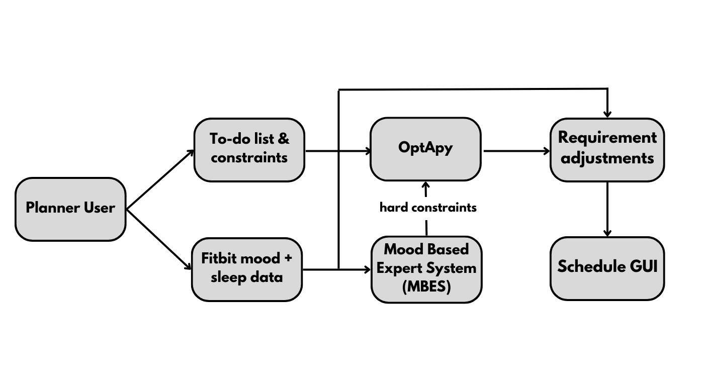

# **Smart Planner**
By Normen Yu, Kiernan Lavelle, Ahmad Bakar, Mark Vernachio, Noor Sanusi, and Sophie Newlin

---

The Smart Planner was created to help students who have overwhelming schedules. The goal was to create an optimized schedule for students, by prioritizing classes and health. 

---
# **Goals, Environment, and Adaptation**

### Goals
- Create a schedule that maximizes productivity, given a to-do list and a person's health/mood.
- Define the exact objective function.
- Identify good data and strategies, to find the best possible schedule.

### Environment
- It would be a Smart Planner App, that could be used on a phone, computer, etc.
- Be able to access and process fitbit data.
- Be able to set priority levels on tasks.
- Be able to receive updates from the user regarding changes in emotions or moods.
- Be able to reschedule tasks in the schedule accordingly, based on data received and priority levels. 

### Adaptation
- In the future, we seek to design data collection strategies to identify how productive users while using the schedule our planner creates.
- Once a week (or at the command of an administrator), the pipeline will cycle through data and make adjustments to training weights or RBES logic to deal with temporal difference and societal changes that may affect the schedule.

---
# **Design and Implementation**

This is a diagram of our system design.
### Methods Used:
- 

---
# Instructions For Using Program
- [Install Python 3.9 or later](https://www.python.org/downloads/)
