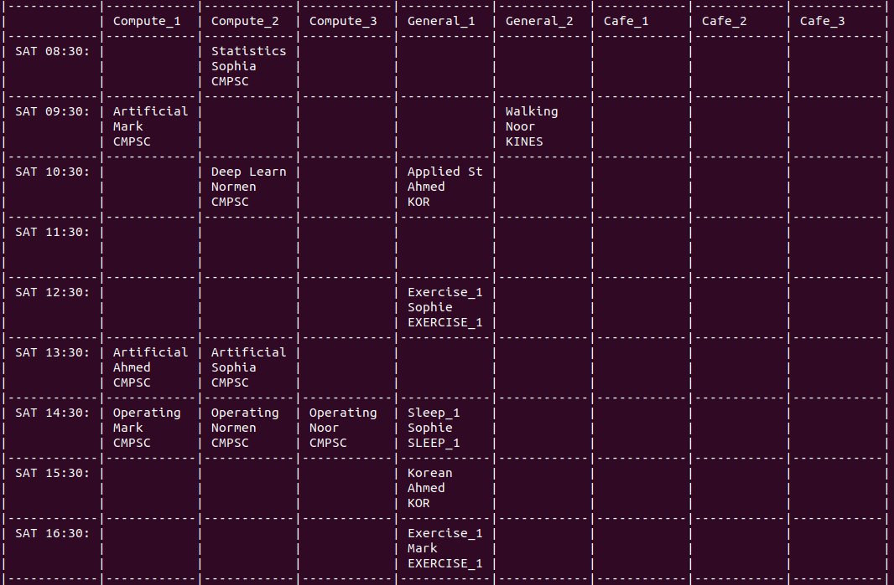

# **Smart Planner**
By Normen Yu, Kiernan Lavelle, Ahmad Bakar, Mark Vernachio, Noor Sanusi, and Sophie Newlin

---

The Smart Planner was created to help students who have overwhelming schedules. The goal was to create an optimized schedule for students, by prioritizing classes and health. 

---
# Quickstart

## Instructions For Using Program
- Requirements for OptaPy:
  - [Install Python 3.9 or later.](https://www.python.org/downloads/)
  - [Install JDK 11 or later](https://adoptium.net/) with the environment variable `JAVA_HOME` configured to the JDK installation directory.

1. Git clone the optapy-quickstarts repo and navigate to this directory:
```
$ git clone https://github.com/optapy/optapy-quickstarts.git
$ cd optapy-quickstarts/school-timetabling
```
2. Activate a virtual environment
```
$ python -m venv venv
$ . venv/bin/activate
```
3. Install the quickstart requirements to the virtual environment
```
$ pip install -r requirements.txt
```
4. Run the application
```
$ python main.py
```
5. To run the application with our sample data, switch to the CMPSC442-final-project directory
```
$ cd
$ cd CMPSC442-final-project
```
6. Install the quickstart requirements to the virtual environment
```
$ pip install -r requirements.txt
```
7. Run the application (now with our data)
```
$ python main.py
```
The output will include a schedule using our data, like the one below:


# Files architecture

### Sample Input Data
- The file [`Merged.csv`](Merged.csv) contains sample health data, including total steps, calories, and more.
- The file [`schedule.csv`](schedule.csv) contains sample input data for students' schedules.

### Changing Application Data
- Add/edit any hand and soft constraints for OptaPy in [`constraints.py`](constraints.py).
- Add/edit any rules for RBES in [`additional_todo.py`](additional_todo.py).
- Add/edit any data in [`schedule.csv`](schedule.csv) and [`Merged.csv`](Merged.csv).
- The entry point and terminal output or visual effects of the program comes from ['main/py'](main.py).
- Key object definitions and infrastructure backbone definitions (such as the representation of rooms, students, and schedules) are definied in ['domain.py'](domain.py).

# **Goals, Environment, and Adaptation**

### Goals
- Create a schedule that maximizes productivity, given a to-do list and a person's health/mood.
  - Health and mood will be based on things like heart rate, amount of sleep, etc.
- Define the exact objective function.
- Identify good data and strategies, to find the best possible schedule.

### Environment
- It would be a Smart Planner App, that could be used on a phone, computer, etc.
- Be able to access and process fitbit data.
- Be able to set priority levels on tasks.
- Be able to receive updates from the user regarding changes in emotions or moods.
- Be able to reschedule tasks in the schedule accordingly, based on data received and priority levels. 

### Adaptation
- In the future, we seek to design data collection strategies to identify how productive users while using the schedule our planner creates.
- Once a week (or at the command of an administrator), the pipeline will cycle through data and make adjustments to training weights or RBES logic to deal with temporal difference and societal changes that may affect the schedule.

---
# **Design and Implementation**

This is a diagram of our system design implementation.

### Methods Used
- We used both OptaPy and RBES to generate the schedule.
- OptaPy
  - OptaPy uses constraints to solve optimization problems, like scheduling.
  - OptaPy has a method called "room assignments," which assigns teachers' classes timeslots to rooms in schools.
    - We updated this method to instead generate a user's schedule based on constraints.
  - We created a set of constraints for OptaPy (which can be seen in [`constraints.py`](constraints.py)):
    - Hard constraints (must be inforced):
      - Rooms have limits to how many students can be in them at one time
      - Rooms must be used for the appropriate tasks
      - A student cannot take two classes at the same time
    - Soft constraints (do not necessarily have to be enforced):
      - Students of the class may prefer to study together
      - Students may prefer to be in the same room for multiple classes
      - Students may prefer not to study back-to-back in their schedule
- RBES (Rule-Based Expert System)
  - RBES creates recommendations based on a set of rules, which can be updated.
  - RBES was tested using merged data to apply rules and generate recommendations.
  - We created a set of rules (which can be seen in [`additional_todo.py`](additional_todo.py)):
    - If calories are less than 1000, add a meal
    - If total steps are less than 5,000 or total distance is less than 5 miles, add exercise
    - If minutes asleep are less than 240, or total steps are greater than 25,000, or total distance is greater than 15 miles, add sleep
- How OptaPy and RBES were brought together:
  - The fitbit data and student schedules are put through the RBES rules, which creates a lesson plan. This plan is put through the constraints from OptaPy. Together, they make an optimized schedule.

### Data Used
- We used Fitbit data (from Kaggle) to source data for many different things, like:
  - Steps walked, active minutes, calories, minutes asleep, and more.
- We also used data from some group members, of their class schedules for a week.
  - The class schedule data is in the file [`schedule.csv`](schedule.csv).
- The Fitbit data was narrowed down and some of the students' names were assigned to user IDs from the Kaggle data.
  - The merged data can be seen in the file [`Merged.csv`](Merged.csv).


